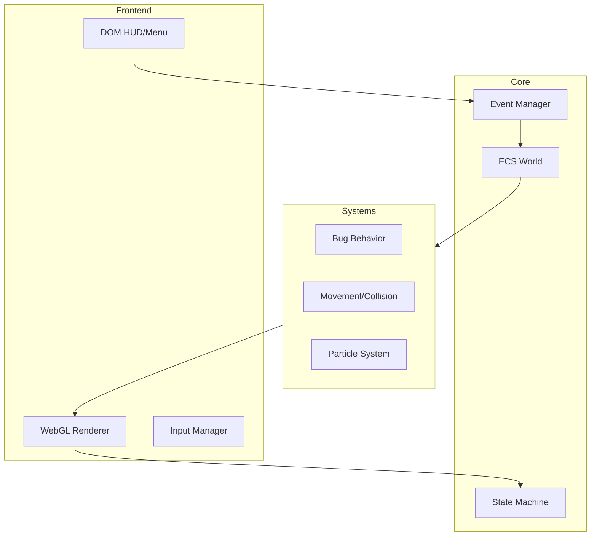

# BugSmasher AAA 🐜🔨

**Enterprise-grade HTML5 bug-smashing engine** built with TypeScript, WebGL 2.0, and a strictly data-oriented architecture.

[](https://www.typescriptlang.org/)
[](https://www.khronos.org/webgl/)
[](#)
[](LICENSE)

---

## 🚀 Vision

BugSmasher AAA is more than a game—it's a demonstration of high-performance modern web technologies. Designed for **60FPS+ stability** on low-end hardware, it leverages a pure **Entity Component System (ECS)** and a custom **WebGL 2.0 Batch Renderer**.

## ✨ Key Features

- **Proprietary ECS Core** — High-performance archetypal entity management with object pooling for zero-GC gameplay.
- **Procedural Asset Pipeline** — Runtime generation of sprites and particle atlases, bridging Canvas2D's flexibility with WebGL's performance.
- **Unified Event System** — Priority-based pub/sub for decoupled, cross-system communication.
- **Hardware-Accelerated Particles** — Thousands of simultaneous particles handled via GPU batching.
- **Spatial Audio Engine** — Dynamic Web Audio API integration with sound pooling and cross-fading.

## 🏗 Architecture

The engine follows a strict separation of concerns:



### Procedural Asset Pipeline
To minimize binary size and allow for infinite variety, BugSmasher AAA generates its assets at boot:
1. **Canvas2D Context**: Procedural generation functions (`initAssets()`) draw bugs/icons to offscreen canvases.
2. **GPU Upload**: The `WebGLRenderer` consumes these canvases as textures during the `LOADING` phase.
3. **Batch Rendering**: The `RenderSystem` uses these textures via sprite keys for efficient rendering.

## 🛠 Tech Stack

| Component | Technology |
|-----------|------------|
| **Core** | TypeScript (Strict Mode) |
| **Bundling** | Vite 5.x |
| **Rendering** | WebKit/WebGL 2.0 |
| **Testing** | Vitest |
| **Styling** | Vanilla CSS (CSS Variables) |

## 📦 Getting Started

```bash
# Clone and install
git clone https://github.com/your-repo/bugsmasher-aaa.git
npm install

# Start development (Port 3000)
npm run dev

# Run full performance suite
npm test
npm run typecheck
```

## 📋 Commands

- `npm run build:prod` — Optimized production bundle.
- `npm run lint` — ESLint static analysis.
- `npm run format` — Prettier code formatting.
- `npm run test:coverage` — Full unit and integration coverage.

## 🤖 AI Agent Compatibility

This repository is **Agent-First**. All architectural decisions are documented for autonomous AI workflows.
- Use `AGENTS.md` (local reference) for coding standards.
- Follow the `namespace:action` event naming convention.
- Respect the strict ECS boundaries (No logic in Components).

---

## 📄 License

MIT © 2026 Fahad Ibrahim / BugSmasher AAA Team
